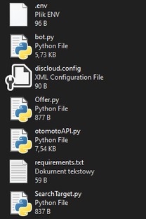
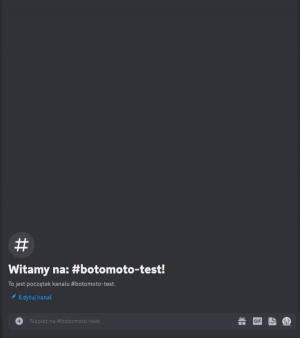

<br/>
<p align="center">
  <h3 align="center">otomoto DiscordBot</h3>
  <p align="center">
    A discord bot that handles searches on <a href="https://otomoto.pl">otomoto.pl</a>. Allows you to add any search by providing the appropriate url link. With a given frequency sends an http query, if there are new offers pings the corresponding user, sending details of new offer
  </p>
</p>

## Setup
Since it is lightweight software, it can be hosted on popular free discord bot hosting sites.
#### Example setup with discloudbot.com
- create new bot on your discord account, following one of many tutorials
- clone repo
```bash
git clone https://github.com/ho-ody/otomotoDiscordBot
```
- create `.env` file, with line containing your discord bot token
```python
DISCORD_TOKEN=`YOUR_TOKEN_HERE`
```
- edit `discloud.config` if needed
- pack all files to `.zip` archive, requiered files below


- open discloudbot.com, login with discord or github account
- create new app, send `.zip` archive and run
## Use
#### commands
- add new search: `$search`  followed by url to search on otomoto.pl
```$search https://www.otomoto.pl/osobowe/bmw?search%5Border%5D=created_at_first%3Adesc)```
- cancel search: `$cancel`, bot will provide future steps
- change refresh rates: 
	- `$$refresh rate X`, where _**X**_ is time in minutes _(specifies general refresh rate)_
	- `$$refresh ignore X`, where _**X**_ is time in minutes _(offers older than given time will be ignored)_
	- _note_: if _**X**_ left empty bot will respond with current value
	- _note_:`refresh rate` should be ⩽ `refresh ignore`
- turn on / off trashtalk: `$$trashtalk` _(after every search bot will send random message)_

## Demo
#### setup

#### otomoto link generation

#### adding search

#### bot found new offer

#### canceling search

